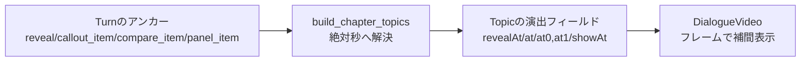

# 開発者ガイド（zundamon-video）

初めてこのコードを触る人向けの実践ガイド。**まず動かし、どこをどう直すか**に絞っている。
設計の全体像・図解は [`architecture.md`](architecture.md) を参照（本書はその実務版）。

> このプロジェクトは「なぜ〇〇は…のか」をずんだもん×四国めたんの掛け合いで解説する動画を、**ローカル完結・無料**で生成する。
> Gemini（台本）→ 画像取得 → 人手レビュー → VOICEVOX（音声）→ `meta.json` 生成 → Remotion（描画）。

---

## 1. 起動方法

### 1.1 前提ツール

| ツール | 用途 | 備考 |
|---|---|---|
| Python 3 | パイプライン・レビューUI | `setup.sh` で `.venv` 作成 |
| Node.js + npm | Remotion描画 | `video/` 配下 |
| VOICEVOX アプリ/エンジン | 音声合成 | **別途起動が必要**（`localhost:50021`）。音声を作る時だけ |
| ffmpeg | WAV→mp3変換 | `tts_voicevox` が利用 |

### 1.2 セットアップ

```bash
bash setup.sh                 # .venv作成＋依存導入＋.env雛形コピー
# .env に GEMINI_API_KEY を記入（必須）。画像APIキーは任意（Pexels/Pixabay）
cd video && npm install && cd ..   # Remotion側の依存
```

`.env`（`.gitignore` 済・**コミット禁止**）の主な変数：

| 変数 | 必須 | 用途 |
|---|---|---|
| `GEMINI_API_KEY` | ✅ | 台本生成（Google AI Studio・無料枠） |
| `PEXELS_API_KEY` / `PIXABAY_API_KEY` | 任意 | ambient画像取得 |
| `VOICEVOX_URL` | 任意 | 既定 `http://localhost:50021`。コンテナからは `host.docker.internal` |

### 1.3 いちばん簡単な実行 — `./run`

フラグを覚えずに済む薄いラッパー。引数なしで**番号メニュー**、`./run help` で一覧。

```bash
./run            # メニュー
./run script     # ① 台本＋画像生成 → レビュー待ちで停止（Gemini新規）
./run review     # ② レビュー画面を開く（http://127.0.0.1:8765）
./run audio      # ③ 音声＋meta生成（要VOICEVOX起動）
./run dev        # ④ Remotion Studio（HMRプレビュー）
./run render     # ⑤ 本編を書き出し → video/out/video.mp4
```

標準的な制作フロー：

```
script → review → audio → dev（確認）→ render
```

途中だけ直す近道：

- 画像だけ取り直す（台本据置）：`./run images`
- 画像/見出しだけ直して音声据置でmeta再生成：`./run meta`
- 1章だけプレビュー/書き出し：`./run dev <章>` / `./run render <章>`（要 `audio` 済み）

> `npm run dev` / `render` は内部で必ず `npm run prep`（`prep.mjs`）を先に走らせ、`docs/story/` の生成物を `video/public/` へ同期する。手動でprepだけ流すこともできる。

### 1.4 テスト（ローカル・無料）

```bash
source .venv/bin/activate
python test_story_script.py && python test_story_meta.py   # 主要ロジックの単体テスト
```

重い依存（Gemini/VOICEVOX/Remotion）はテストではモックされる。ロジック変更時はまずここで回す。

---

## 2. フォルダ構成

```
/workspace
├── run                     # 制作ラッパー（コマンド/番号メニュー）
├── main_story.py           # ★パイプラインのオーケストレータ（CLI入口）
├── review_server.py        # ★レビューUIのローカルWebサーバ/API（stdlibのみ）
├── review_story_page.html  #   メイン制作UI（HTML/CSS/JS）
├── make_depth.py           # 深度マップ生成（パララックス用・ローカル推論）
├── src/                    # パイプライン部品
│   ├── story_script.py     #   台本データモデル＋Gemini呼び出し（1559行）
│   ├── tts_voicevox.py     #   VOICEVOX音声合成＋タイミング算出
│   ├── image_fetch.py      #   画像取得の振り分け（subject/ambient）
│   ├── {pexels,pixabay,wikimedia}_client.py  # 画像API各クライアント（無料）
│   ├── manual_cuts.py      #   手動カット補助
│   └── topic_history.py    #   既出ネタ履歴（重複回避）
├── config/
│   ├── config.story.yaml   #   ★パイプライン設定（話者ID・尺・音声・SE/BGM等）
│   └── readings.json       #   読み仮名辞書
├── docs/
│   ├── story/              # ★本編の生成物（script/review/meta/digest/画像）
│   ├── shorts/<slug>/      # 縦ショート（本編と同じ構成を slug 毎に）
│   ├── architecture.md     # 設計の全体像（図解）
│   └── DEVELOPER_GUIDE.md  # 本書
└── video/                  # Remotionプロジェクト（TypeScript/React）
    ├── scripts/prep.mjs    #   描画前の同期（meta/画像/音声/manifest生成）
    ├── public/             #   prep.mjs が生成する描画入力
    └── src/
        ├── Root.tsx        #   ★Composition定義（横/章/縦ショート）
        ├── DialogueVideo.tsx #  ★描画本体（1836行・全演出をここで描く）
        ├── Avatar.tsx      #   パーツ分け立ち絵＋リップシンク
        ├── ParallaxImage.tsx # 2.5D深度パララックス（WebGL）
        └── types.ts        #   ★meta.json の型定義（全フィールド説明あり）
```

**最重要の境界**：Python側（生成）と `video/`（描画）は **`meta.json` だけで疎結合**。Pythonは「何を・いつ出すか」を `meta.json` に書き、Remotionはそれを描くだけ。

---

## 3. UI構成（制作ツール ＝ `review_server.py` + `review_story_page.html`）

画像取得後に人が確認・差し替えするローカルWebツール。**Python標準ライブラリのみ**（Flask等不使用）。メインUIは `review_story_page.html`、APIと他ページは `review_server.py` に置く。

```bash
python review_server.py --dir docs/story --port 8765   # ./run review でも可
```

### 画面（GETページ）

| ルート | 役割 | 主な操作 |
|---|---|---|
| `/` | ランディング（進捗ダッシュボード） | 各ステージの状態確認 |
| `/story` | ★メイン review/edit UI | 台本編集・画像差し替え・演出設定 |
| `/read` | 読み専用ファクトチェック | 全文＋要約の確認 |
| `/script` | 台本メタ編集 | インポート等 |
| `/shorts` | ショート作成ハブ | ネタ選択→一括生成→個別レビュー |
| `/compose` | ブラウザAI用プロンプト | コピペ運用 |

### `/story` の構造（`review_story_page.html` が本体）

4領域（左 = 台本、中央 = Remotionプレビュー、右 = 設定、下 = タイムライン）。ダークテーマ。

ヘッダーの「台本 / 演出」で作業モードを切り替える。台本モードはRemotionを停止して左右50:50と下段タイムラインを表示し、演出モードは4領域へ戻る。選択状態は `localStorage` の `reviewWorkspaceMode` に保存される。

- **左ペイン**：章カード（`.chsec`・intro/trivia/outro）＋ Discord風のセリフ行カード（`.line`・話者色ドット＋名前＋本文＋画像サムネ）。演出が範囲にまたがる場合は可視化レール（ハンドル）で範囲指定。
- **右ペイン**（`.tp-right`）：
  - 画像パネル … クロップ/差し替え（ドラッグ・ドロップ・URL取込）、フィルタ（明度/コントラスト/グレースケール）、`fit`（cover/contain）、padding/背景色
  - 候補ピッカー（`.candpanel`）… Pexels/Pixabay/Wikimedia のサムネ一覧・ソース別タブ・言語切替・ページング
  - 演出エディタ（タブ）… `telop` / `reaction` / `quiz` / `compare` / `stat` / `callouts` / `panel`

### サーバ↔ブラウザのやり取り

サーバはステートレス、保存は都度 `/api/*`（JSON）。クライアント状態は埋め込みJSのグローバル（`CUTS` / `cutMap` / `OPEN` / `selChs` / `selGi` / `rwide` / `selSeg` 等）。

主なAPI：`/api/script`（保存）・`/api/fetch`（1カット取得）・`/api/candidates`（候補取得）・`/api/approve`（承認）・`/api/options`（crop/filter/pad/bg/hide）・`/api/import-url`・`/api/replace`（base64アップロード）・`/api/delete-cut`（削除＋再採番）・`/api/regenerate`（章再生成＝Gemini）。画像配信は `GET /img/<key>`（key=`NN_MM`）。

### ファイル内の構成（行レンジ目安）

| 範囲 | 内容 |
|---|---|
| 41–199 | ストレージ層（`load_review`/`save_review`/`load_script`/`image_dims` 等） |
| 201–344 | ショート管理・ジョブキュー（subprocessポーリング） |
| 909–928 | `_BASE_CSS`（テーマ変数・共通スタイル） |
| 930–1375 | `LANDING_PAGE` / `SHORTS_PAGE` / `COMPOSE_PAGE` / `SCRIPT_PAGE` |
| 外部ファイル | **`review_story_page.html`（メインUI）** |
| `READ_PAGE` | 読み専用ファクトチェックページ |
| `Handler` 以降 | HTTPハンドラ（`do_GET`/`do_POST`）と `main()` |

> 中央プレビューは Remotion Player で本番の `DialogueVideo` を表示する。利用できない場合のみ簡易プレビューへフォールバックする。

---

## 4. データ構造

ディスク上のJSONが唯一の真実。`docs/story/` に各ステージが読み書きする。

| ファイル | 書き手 | 読み手 | 内容 |
|---|---|---|---|
| `script.json` | Gemini / レビューUI | `--from-script`・音声・meta | 台本（`chapters[]`＋`script[]`） |
| `review.json` | `image_fetch` / レビューUI | `build_meta` | カット毎の `approved`/`crop`/`filter`/`fit`/出典 |
| `meta.json` | `build_meta` | **Remotion（唯一の描画入力）** | `speakers`/`topics[]`/`script[]`/`audio` |
| `digest.mp3` | `tts_voicevox` | Remotion `<Audio>` | 連結済み音声 |
| `ch_NN_MM.*` | `image_fetch` / レビューUI | `prep.mjs`→Remotion | 章×カット画像（＋`.depth.png`） |

### 4.1 台本側（`script.json`）

```jsonc
{
  "theme": "なぜ横浜駅は迷宮なのか",
  "chapters": [
    {
      "section": "intro",            // intro / trivia / outro
      "title": "見出し（10-18字）",
      "image_cuts": [                // この章で使う画像（複数可）
        { "image_query": "yokohama station", "image_kind": "subject" }  // subject=被写体 / ambient=雰囲気
      ],
      // 任意：章に最大1種の演出定義
      "quiz":   { "question": "...", "answer": "..." },
      "compare":{ "left": {"label":"..","cut":0}, "right": {"label":"..","cut":1} },
      "stat":   { "value": "50万", "unit": "人", "label": ".." },
      "callouts":[ { "text":"..", "x":0.5, "y":0.3, "arrow":true } ],
      "panel":  { "heading":"..", "items":[ {"text":".."} ] }
    }
  ],
  "script": [
    {
      "speaker": "ずんだもん", "text": "セリフ", "emotion": "surprise",
      "section": "trivia", "chapter": 1,
      "effect": "zoom_punch",       // ★大演出（kenburns/zoom_punch/shake/flash/glow_pulse）
      "cut": 0,                     // この発言で映す image_cuts の番号
      // 小演出の時刻アンカー（任意）：
      "reveal": true,               // quiz/stat の答えを出す瞬間
      "callout_item": 0,            // callouts[n] を出す
      "compare_item": 1,            // compare の左(0)/右(1) を出す
      "panel_item": 0, "panel_event": "shrink",
      // 重ねがけ小演出（Turn直書き・任意）：
      "telop": "迷宮", "reaction": "😲",
      // 音声操作（任意）：
      "voice": {"speed":1.0,"pitch":0.0}, "pause": 0.5, "chorus": true
    }
  ]
}
```

### 4.2 描画側（`meta.json`） — 型は `video/src/types.ts`

`build_meta` が台本＋音声タイミング＋`review.json` をマージして生成。Remotionが読む唯一の入力。

- `speakers[]`：話者の `gender`/`avatar`/`expressive`。**配列順が画面の左右**。
- `topics[]`：中央ビジュアルの**時間スライス**（`start`/`end`＋`image`＋演出の解決済みフィールド `quiz.revealAt`/`stat.showAt`/`callouts[].at`/`compare.at0/at1`/`panel.items[].at`）。
- `script[]`：`Turn`（`start`/`end`/`sentences[]`/`effect`/`telop`/`reaction` 等）。
- `audio`：`{ bgm, se, events[] }`。
- `avatarManifest` / `depthMaps`：`prep.mjs` が `loadMeta` 時に注入。

> **型の語彙は `types.ts` に全部コメント付きで載っている。** データで迷ったらまずここを読む。

---

## 5. Remotionの使い方

### 5.1 プレビューと書き出し

```bash
cd video
npm run dev            # Remotion Studio（HMR）。ブラウザで全Composition確認
npm run render         # 本編書き出し → out/video.mp4
npm run render:short   # 縦ショート → out/short.mp4（SRC_DIR=../docs/shorts/<slug>）
```

`./run dev` / `./run render` 経由が楽（prep自動・章単位も可）。

### 5.2 Composition（`Root.tsx`）

3つとも中身は同じ `DialogueVideo`。レイアウトだけ違う。

| id | 用途 | 解像度 |
|---|---|---|
| `DialogueVideo` | 本編（横16:9） | 1920×1080 |
| `DialogueChapter` | 1章だけ横プレビュー（`./run dev <章>`） | 1920×1080 |
| `DialogueVideoShort` | 縦ショート（1ネタ切抜き・hook/CTA付） | 1080×1920 |

各 `calculateMetadata` が `loadMeta()` で `meta.json`＋manifestを読み、尺（`durationInFrames`）と `props` を決める。

### 5.3 描画の考え方（重要）

Remotion描画は **「フレーム t → 何を出すか」を純関数的に計算**する。`useState` ではなく `useCurrentFrame()` が基点。

- `pickActive(meta.script, t)` … 現在の話者・字幕
- `pickActive(meta.topics, t)` … 現在の中央ビジュアル
- アニメは `interpolate()` / `spring()` でフレームから導出
- リップシンクは `useAudioData(digest.mp3)` の波形RMS → 口パーツ選択

### 5.4 prep（`video/scripts/prep.mjs`）

`npm run dev/render` の前に自動実行。`docs/story/`（または `SRC_DIR`）→ `video/public/` へ：

- `meta.json` / `digest.mp3` / `ch_*.{jpg,png,webp,gif}` / `*.depth.png` をコピー
- `assets/avatars/<キャラ>/` を走査して `avatars/manifest.json` 生成（立ち絵パーツ一覧）
- `depth-manifest.json` 生成（深度が揃った画像一覧）
- `assets/`（fonts/background/bgm/se）コピー、`meta.audio` の未配置BGM/SE参照を除去

---

## 6. 演出追加方法

### 6.1 大演出（Effect）を1種足す場合

「画面の動き」を1つ追加する流れ。例として `new_fx` を足すなら：

1. **型に追加** … `video/src/types.ts` の `Effect` ユニオンに `"new_fx"` を追加。
2. **バリデーション** … `src/story_script.py` の `VALID_EFFECTS`（56行付近）に追加（不正値は `kenburns` に倒れる）。
3. **プロンプト** … 必要なら `story_script.py` のプロンプト説明（90行付近）に使いどころを追記し、Geminiが付与できるようにする。
4. **描画** … `video/src/DialogueVideo.tsx` の `effectState()`（790行付近）に分岐を追加し、フレームから transform/オーバーレイを算出。

> `effect` は **Turn単位** で付き、`build_meta` が `Topic` に伝搬する。新フィールド追加が不要なら 1〜2 と 4 だけで動く。

### 6.2 小演出（オーバーレイ/中央置換）を足す場合

共通パターン：**台本にアンカー → `build_chapter_topics` が絶対秒へ解決 → Remotionが補間表示**。



新しい小演出 `foo` を足すなら、以下を一通り触る（既存の `stat`/`callouts` を雛形にコピーするのが速い）：

| 触る場所 | 既存例（参照） | やること |
|---|---|---|
| `video/src/types.ts` | `Stat` / `Callout` 型 | `Foo` 型と `Topic.foo` を定義 |
| `src/story_script.py` | quiz/stat の正規化 | 章定義 `foo` の検証（`normalize_turns` 周辺）＋必要ならアンカー（`foo_item` 等） |
| `main_story.py` | `_reveal_time` / `_resolve_viz` | `build_chapter_topics` で `foo` の出現時刻を解決（`showAt` 等を計算） |
| `video/src/DialogueVideo.tsx` | `StatOverlay` / `CalloutOverlay` | サブコンポーネントを追加し、中央ビジュアル層 or オーバーレイ層に差し込む |
| `review_server.py` | telop/stat タブ | （任意）`/story` の演出エディタにタブ/フォームを追加 |

既存の小演出と時刻解決の対応：

| 小演出 | 台本アンカー | 解決先 | 描画コンポーネント |
|---|---|---|---|
| `telop` / `reaction` | Turn直書き | — | `DialogueVideo` 内インライン |
| `quiz` | `reveal` or `effect==zoom_punch` | `revealAt` | `QuizVisual` |
| `compare` | `compare_item==0/1` | `at0`/`at1` | `CompareVisual` |
| `stat` | `reveal` 系 | `showAt` | `StatOverlay` |
| `callouts` | `callout_item==n` | 各 `at` | `CalloutOverlay` |
| `panel` | `panel_item`/`panel_event` | `item.at`/`shrinkAt` | `DialoguePanel` |

### 6.3 立ち絵パーツ・キャラを足す

`assets/avatars/<キャラ>/` にパーツ画像（base/mouth_*/eye_* 等）を置く → `prep.mjs` が `manifest.json` を再生成 → `Avatar.tsx` が自動合成。パーツ未配置時は単一画像にフォールバック。話者→フォルダは `meta.speakers[].avatar`、無ければ名前から既定解決（ずんだもん/めたん）。

---

## 7. よくある修正箇所

| やりたいこと | 触る場所 |
|---|---|
| 話者・声・話速・VOICEVOX ID | `config/config.story.yaml`（`tts_voicevox.speakers` 等） |
| 読み間違いを直す | `config/readings.json`（読み仮名辞書） |
| 尺・往復数・1発言の長さ制御 | `config/config.story.yaml`＋`story_script.py` のプロンプト |
| 台本のトーン/構成（Geminiの指示） | `src/story_script.py` の `build_prompt` 周辺 |
| 画像の取得元・振り分け | `src/image_fetch.py`（subject→Wikimedia / ambient→Pexels→Pixabay→Wikimedia） |
| 中央ビジュアル枠の位置/大きさ | `DialogueVideo.tsx` の `BOARD_LANDSCAPE` / `BOARD_PORTRAIT`（45行付近） |
| 字幕・立ち絵・バッジのレイアウト | `DialogueVideo.tsx` の `layoutFor()`（縦/横） |
| 大演出の効き具合 | `DialogueVideo.tsx` の `effectState()` / `KEN_BURNS[]` |
| リップシンクの感度 | `DialogueVideo.tsx` の `LIPSYNC_GAIN`、`Avatar.tsx` の口閾値 |
| BGM/SEの鳴らし方 | `config.story.yaml` の audio 設定＋`main_story.build_audio` |
| レビューUIの見た目・操作 | `review_story_page.html` ＋ `review_server.py` の `_BASE_CSS` |
| ショートの上限秒・CTA文言 | `Root.tsx` の `SHORT_MAX_SEC` / `DEFAULT_SHORT_CTA` |

---

## 8. 改修時の注意点

### プロジェクト方針（`CLAUDE.md` 準拠）

- **従量課金・情報漏洩リスクのある実装は禁止**（例外なし）。外部API追加は無料枠/ローカルのみ。秘密情報は `.env` 管理、コミット禁止。
- 個人開発・成果物重視。過剰な抽象化や将来拡張のための設計は避ける。
- バグ修正は**横展開**（同じ構造の処理が他にないか確認してまとめて直す。例：文単位を直したらターン単位、開始を直したら終了）。
- 反復検証はまず**ローカル**で。重い依存はモックで切り離す。

### 技術的な落とし穴

- **`meta.json` が単一の契約**。型変更は必ず `video/src/types.ts` ↔ `story_script.py`（`VALID_EFFECTS` 等）↔ `build_meta`/`build_chapter_topics` の3点を**揃えて**直す。片側だけ直すと描画が無視 or 壊れる。
- **時刻はミリ秒量子化**（3桁）。新しい演出時刻も同じ流儀に合わせる。
- **画像ファイル名は `ch_NN_MM.ext` が規約**。レビューUIの削除は再採番（`reindex_review_after_cut_delete`）でファイルもリネームされる。手で消すと番号がずれる。
- **音声を作り直さない節約パス**を壊さない：`--meta-only` は既存の `start/end/sentences` を据え置いて `meta.json` だけ作り直す。タイミング由来の処理を変えるときは `--images-from-dir`（音声から作り直し）と両方を確認。
- **`prep.mjs` を経由しないと描画は古い**。`docs/story/` を直接書き換えても、`npm run dev/render`（＝prep）を通すまで `video/public/` に反映されない。
- **VOICEVOX 起動が前提**（音声時のみ）。未起動だと `audio` 系コマンドが失敗する。台本/描画だけなら不要。
- **レビューUIサーバは stdlib のみ**。外部Webフレームワークを足さない方針。メインUIは `review_story_page.html`、共通CSSと他ページは `review_server.py` に置く。
- **Studio の章プレビューは再起動が必要**な場合がある（`REMOTION_CHAPTER` はバンドル時埋め込み）。dev中に meta/画像を変えたら Studio を再起動。

### 変更後の確認

1. `python test_story_script.py && python test_story_meta.py`（ロジック）
2. `./run dev`（または `./run dev <章>`）で見た目を目視
3. 最終は `./run render` で書き出し確認

---

## 付録：最短理解ルート（迷ったらこの順）

1. `video/src/types.ts` … データの語彙（全フィールドにコメント）
2. `run` … 制作フローの全体
3. `main_story.py` の `build_meta` / `build_chapter_topics` … 台本→描画データ変換
4. `video/src/Root.tsx` → `DialogueVideo.tsx`（`effectState` と各 `*Visual`/`*Overlay`）
5. `review_story_page.html` … 制作ツールUI
6. 全体像が欲しくなったら [`architecture.md`](architecture.md)
