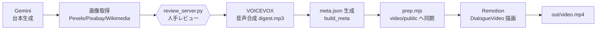
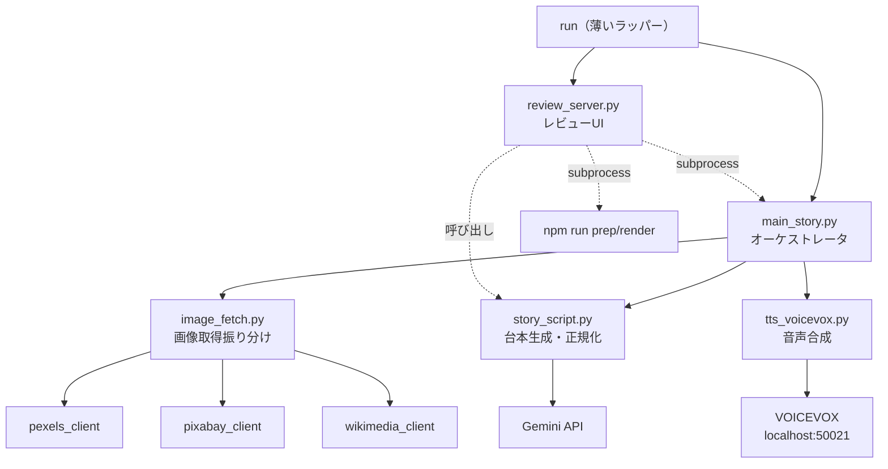
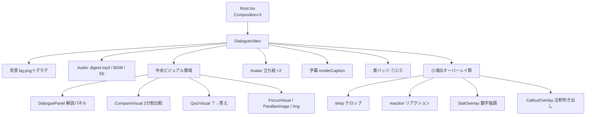
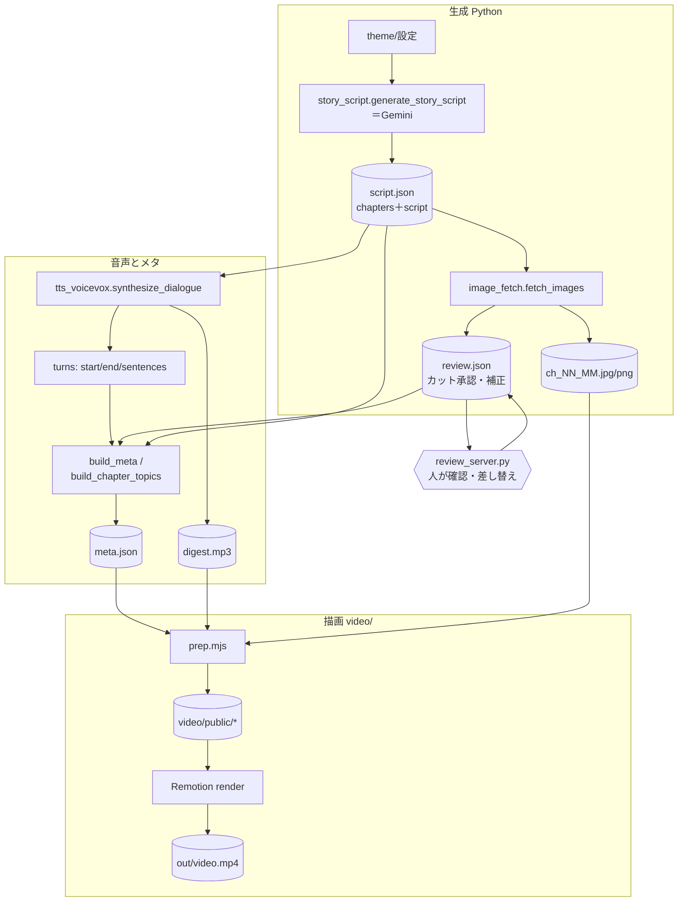
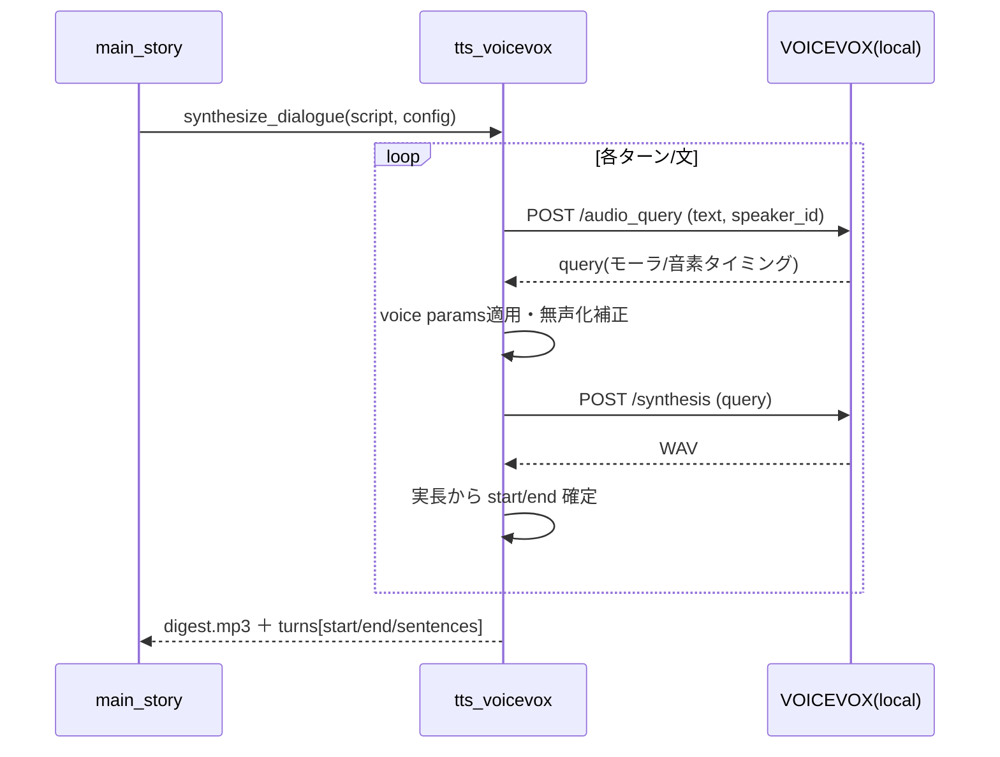
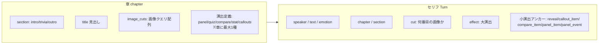
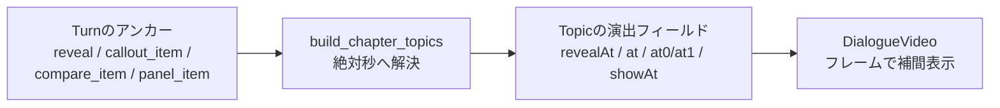
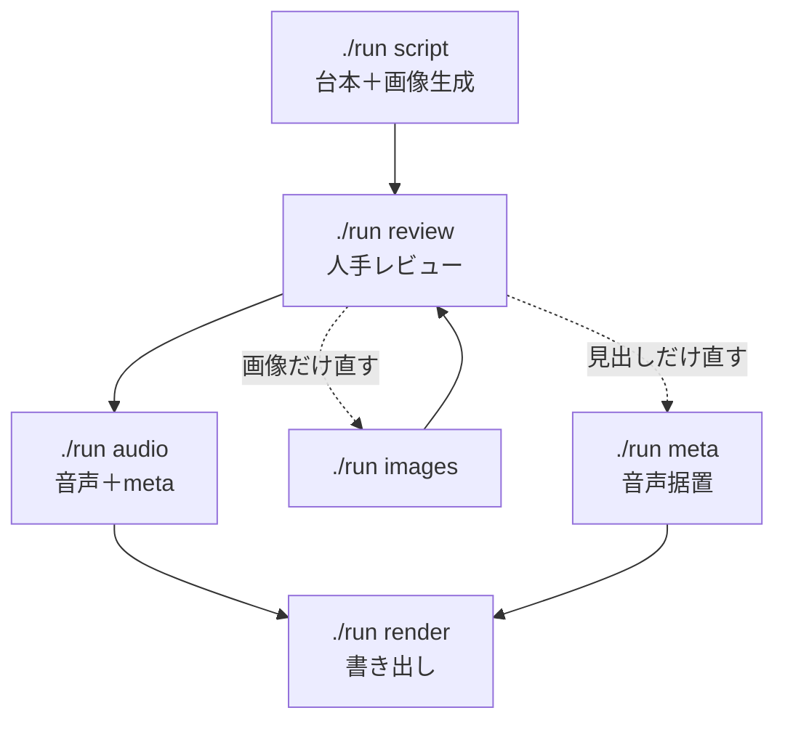

# アーキテクチャ概要（zundamon-video）

ずんだもん掛け合いによる「なぜ〇〇は…のか」深掘り解説動画を、**ローカル完結・無料**で生成するパイプライン。
台本生成（Gemini）→ 画像取得 → 人手レビュー → 音声合成（VOICEVOX）→ `meta.json` 生成 → Remotion描画、という流れ。

> このドキュメントの目的：新規開発者が **30分で全体像** をつかむこと。UI/UX改善の起点は主に [`review_server.py`](#5-レビューui-human-in-the-loop) と Remotion描画（[`DialogueVideo.tsx`](#7-remotion描画レイヤー)）。

---

## 0. 30秒サマリ

- **言語/技術**：Python（パイプライン・レビューUI）＋ TypeScript/React/Remotion（描画）。追加の重量級依存・従量課金APIは不使用。
- **唯一の連携フォーマット**：Python側が出力する **`meta.json`** が全ての画面情報の単一ソース。Remotionはこれと `digest.mp3` だけ読む。
- **人手チェックポイント**：完全自動を断念し、画像取得後に `review_server.py`（ローカルWeb）で人が確認・差し替えしてから音声生成へ進む半自動方式。
- **外部サービス**：Gemini（台本生成のみ・無料枠）、画像API（Pexels/Pixabay/Wikimedia・無料）、VOICEVOX（**ローカル**HTTPエンジン）、Depth Anything V2（**ローカル**推論）。



---

## 1. ディレクトリ構造

```
/workspace
├── run                     # 制作ラッパー（薄い）。番号メニュー/コマンドで下記を叩くだけ
├── main_story.py           # ★パイプラインのオーケストレータ（CLI入口）
├── review_server.py        # ★レビューUIのローカルWebサーバ/API（stdlibのみ）
├── review_story_page.html  #   メイン制作UI（HTML/CSS/JS）
├── make_depth.py           # 深度マップ生成（パララックス用・ローカル推論）
├── src/                    # パイプライン部品
│   ├── story_script.py     #   台本データモデル＋Gemini呼び出し（1559行）
│   ├── tts_voicevox.py     #   VOICEVOX音声合成＋タイミング算出
│   ├── image_fetch.py      #   画像取得の振り分け（subject/ambient）
│   ├── pexels_client.py    #   画像API各クライアント（無料）
│   ├── pixabay_client.py
│   ├── wikimedia_client.py
│   ├── manual_cuts.py      #   手動カット補助
│   └── topic_history.py    #   既出ネタ履歴（重複回避）
├── config/                 # 設定・読み仮名辞書
│   └── readings.json
├── topic_history/          # ジャンル別の既出ネタ履歴（tech.json / yokohama.json）
├── docs/
│   ├── story/              # ★本編の生成物（下記「データフロー」参照）
│   │   ├── script.json     #   台本＋章メタ（再入力可）
│   │   ├── review.json     #   画像カットの承認状態・補正（レビューUIが読み書き）
│   │   ├── meta.json       #   ★描画用の単一ソース
│   │   ├── digest.mp3      #   合成音声
│   │   └── ch_NN_MM.*      #   章×カットの画像（＋ .depth.png 深度マップ）
│   ├── shorts/<slug>/      # 縦ショート（本編と同じファイル構成を slug 毎に持つ）
│   └── architecture.md     # 本書
└── video/                  # Remotionプロジェクト（TypeScript/React）
    ├── package.json        #   dev/render/prep スクリプト
    ├── remotion.config.ts  #   jpeg出力・上書き許可
    ├── scripts/prep.mjs    #   ★描画前の同期処理（meta/画像/音声/manifest生成）
    ├── public/             #   prep.mjs が生成する描画入力（meta.json/digest.mp3/avatars等）
    └── src/
        ├── index.ts        #   registerRoot
        ├── Root.tsx        #   ★Composition定義（横/章/縦ショート の3種）
        ├── DialogueVideo.tsx #  ★描画本体（1836行・全演出をここで描く）
        ├── Avatar.tsx      #   パーツ分け立ち絵＋リップシンク＋表情
        ├── ParallaxImage.tsx # 2.5D深度パララックス（WebGL・ショート用）
        ├── types.ts        #   ★meta.json の型定義（全フィールドの説明あり）
        └── fonts.ts        #   日本語フォントの明示ロード（豆腐防止）
```

ポイント：**Python側（生成）と video/（描画）は `meta.json` でのみ疎結合**。`prep.mjs` がその橋渡し（`docs/story/` → `video/public/`）。

---

## 2. コンポーネント構造

「コンポーネント」は2系統ある。**(A) パイプラインのモジュール** と **(B) Remotion描画のReactコンポーネント**。

### (A) パイプライン・モジュール



### (B) Remotion描画コンポーネント（`DialogueVideo.tsx` 内）



`DialogueVideo.tsx` は単一の大コンポーネントで、中に `QuizVisual` / `CompareVisual` / `StatOverlay` / `CalloutOverlay` / `DialoguePanel` / `FocusVisual` などのサブコンポーネントをインラインで定義している。`Avatar` と `ParallaxImage` のみ別ファイル。

---

## 3. 状態管理

このプロジェクトに**実行時の集中状態ストアは無い**。状態は3層に分かれる。

| 層 | 実体 | 性質 |
|---|---|---|
| **永続データ** | `docs/story/*.json`（script/review/meta） | ディスク上のJSONファイルが唯一の真実。各ステージが読んで次を書く |
| **描画状態** | Remotionの `useCurrentFrame()` 由来 | フレーム番号から全表示を**純関数的に**算出（ReactのuseState等はほぼ使わない） |
| **レビューUIのクライアント状態** | `review_server.py` 内の埋め込みJSのグローバル変数 | `CUTS` / `cutMap` / `OPEN` / `selChs` / `selGi` / `rwide` / `selSeg` 等。サーバ側はステートレス、保存は都度 `/api/*` でJSONへ |

要点：Remotion描画は「**フレーム t → 何を出すか**」を都度計算する設計。`pickActive(meta.script, t)` で現在のターン、`pickActive(meta.topics, t)` で現在の画像を引く。アニメは `interpolate()` と `spring()` でフレームから導出する。

---

## 4. データフロー



**ファイル別の責務（`docs/story/`）**

| ファイル | 書き手 | 読み手 | 内容 |
|---|---|---|---|
| `script.json` | `story_script`（Gemini）/ レビューUI | `--from-script`・音声・meta | 台本（`chapters[]`＋`script[]`） |
| `review.json` | `image_fetch` / レビューUI | `build_meta` | 各カットの `approved` / `crop` / `filter` / `fit` / 出典 等 |
| `meta.json` | `build_meta` | **Remotion（唯一の描画入力）** | `speakers` / `topics[]` / `script[]` / `audio` / manifest |
| `digest.mp3` | `tts_voicevox` | Remotion `<Audio>` | 連結済み音声 |
| `ch_NN_MM.*` | `image_fetch` / レビューUI | `prep.mjs`→Remotion | 章×カット画像（＋深度） |

**再入力ポイント**（やり直しを安く済ませる設計）

- `--from-script script.json`：Gemini再生成をスキップ
- `--images-from-dir`：`review.json` の承認画像を使い、音声を作り直す
- `--meta-only`：音声据え置きで `meta.json` だけ再生成（画像/見出しだけ直した時）

---

## 5. レビューUI（Human-in-the-loop）

`review_server.py`（**Python標準ライブラリのみ**、Flask等不使用）が `http.server.BaseHTTPRequestHandler` + `ThreadingHTTPServer` でAPIとページを配信する。メイン制作UIは `review_story_page.html` に分離し、その他の小規模ページはPython文字列定数として保持する。

> **UI/UX改善の主戦場はここ。** ダークテーマの4領域構成を維持し、段階的に改善する。

```bash
python review_server.py --dir docs/story --port 8765   # ./run review でも可
```

### 画面（GETページ）

| ルート | 役割 |
|---|---|
| `/` | ランディング（パイプライン進捗ダッシュボード） |
| `/story` | ★メインの review/edit UI（左=台本、中央=Remotion、右=設定、下=タイムライン） |
| `/read` | 読み専用のファクトチェック表示 |
| `/script` | 台本メタ編集 |
| `/shorts` | ショート作成ハブ（ネタ選択→一括生成→個別レビュー） |
| `/compose` | ブラウザAI用プロンプト（コピペ運用） |

`/story` のヘッダーで作業モードを切り替えられる。**演出モード**は4領域、**台本モード**はプレビューとタイムラインを停止して台本・設定を50:50で表示する。選択はブラウザの `localStorage` に保存する。

### 主なAPI（POST・JSON body）

`/api/fetch`（1カット取得）・`/api/candidates`（候補サムネ取得）・`/api/script`（保存）・`/api/approve`（承認）・`/api/options`（crop/filter/pad/bg/hide適用）・`/api/import-url`・`/api/replace`（base64アップロード）・`/api/delete-cut`（削除＋再採番）・`/api/regenerate`（章再生成＝Gemini）・`/api/set-dir`（本編/ショート切替）・`/api/shorts/*`。
画像配信は `GET /img/<key>`（key = `NN_MM`）。

### ファイル内のおおまかな構成（行レンジ目安）

| 範囲 | 内容 |
|---|---|
| 41–199 | ストレージ層（`load_review`/`save_review`/`load_script`/`image_dims` 等。将来のKV移行を見越しパス隠蔽） |
| 201–344 | ショート管理・ジョブキュー（subprocess起動とポーリング） |
| 909–928 | `_BASE_CSS`（テーマ変数・共通スタイル） |
| 930–1375 | `LANDING_PAGE` / `SHORTS_PAGE` / `COMPOSE_PAGE` / `SCRIPT_PAGE` |
| 外部ファイル | **`review_story_page.html`（メインUI：章・行・演出エディタ・画像ピッカー・タイムライン）** |
| `READ_PAGE` | 読み専用ファクトチェックページ |
| `Handler` 以降 | HTTPハンドラ（`do_GET`/`do_POST` ルーティング）と `main()` |

### プレビューについて

`/story` の中央には Remotion Player を埋め込み、本番と同じ `DialogueVideo` を16:9で確認する。meta未生成やPlayer未ビルド時のみ簡易プレビューへフォールバックする。

---

## 6. VOICEVOXとの接続箇所

実体は `src/tts_voicevox.py`。**完全ローカル・無料**（従量課金なし）。

- **接続先**：`http://localhost:50021`（`VOICEVOX_URL` 環境変数または `config.tts_voicevox.base_url` で変更可）。
- **話者対応**：`config.tts_voicevox.speakers` が台本の話者名（例「ずんだもん」）→ VOICEVOX speaker ID（例 3）へマップ。
- **エンドポイント**：`/audio_query`（テキスト→モーラ/音素タイミング等のクエリ取得）→ `/synthesis`（クエリ→WAV）。
- **声の演技**：クエリの `speedScale`/`pitchScale`/`intonationScale`/`volumeScale` に適用。グローバル既定＜話者別＜ターン別 `turn["voice"]` の順で上書き（`_effective_voice`）。
- **タイミング算出**：**Whisper不要**。文ごとに合成し、各WAVの実長（`nframes/framerate`）からそのまま `start`/`end` を確定。文内の字幕単位へは文字数比で按分（`sentences[]`）。`audio_query` のモーラ情報は無声化補正（`fix_devoiced_moras`）に使用。
- **間（pause）/ ユニゾン（chorus）**：`inter_turn_pause`＋ターン別 `pause` で無音挿入。`chapter_gap_pause` で章境界に追加の間。`chorus=true` のターンは全話者で同一文を合成し `_mix_pcm()` でPCM合成（締めの挨拶等）。
- **出力**：`synthesize_dialogue()` が PCM→WAV→（ffmpegで）`digest.mp3`、および `turns[]`（`{start,end,sentences:[{text,start,end}]}`）を返す。後者が `build_meta` のタイミング源。



---

## 7. Remotion描画レイヤー

### Compositionの接続（`Root.tsx`）

`registerRoot(RemotionRoot)`（`index.ts`）。`Root.tsx` が3つのCompositionを定義し、すべて中身は同じ `DialogueVideo` を別レイアウトで使う。

| Composition id | 用途 | 解像度 | 尺の決め方 |
|---|---|---|---|
| `DialogueVideo` | 本編（横16:9） | 1920×1080 | `meta.script` の末尾 `end` と `digest.mp3` 実尺の長い方＋末尾余韻 |
| `DialogueChapter` | 1章だけ横プレビュー（`./run dev <章>`） | 1920×1080 | `computeClip()` で章の時間窓にクリップ |
| `DialogueVideoShort` | 縦ショート（1ネタ切り抜き） | 1080×1920 | 章窓を60秒上限でクリップ、`hook`/CTA付与 |

各Compositionの `calculateMetadata` が `loadMeta()` で `meta.json`＋立ち絵manifest＋深度manifestを読み、`durationInFrames` と `props`（`meta`/`clipStartSec`/`clipEndSec`/`portrait`/`hookText`/`ctaText`/`clipChapter`）を解決する。

### 描画前の同期（`prep.mjs`＝`npm run prep`）

`docs/story/`（または `SRC_DIR`）の生成物を `video/public/` へ集約する橋渡し。

- `meta.json` / `digest.mp3` / `ch_*.{jpg,png,webp,gif}` / `*.depth.png` をコピー
- `assets/avatars/<キャラ>/` を走査し **`avatars/manifest.json`**（`{キャラ:{パーツ名:ファイル}}`）を生成
- **`depth-manifest.json`**（深度マップが揃った画像一覧）を生成
- `assets/`（fonts/background/bgm/se）をコピー
- `meta.audio` の **未配置BGM/SE参照を除去**（無ければ無音で描画継続）

### セリフブロック（Turn）の仕組み

`meta.script` の各 `Turn` が `start`/`end`（秒）を持つ。描画は現在フレーム `t` から：

1. `pickActive(meta.script, t)` で**現在話者**を解決 → 立ち絵の発話側・字幕・名前色を決定。
2. 字幕は `turn.sentences[]` があれば文単位、無ければ `turn.text`。`renderCaption()` が下部中央に描画。`chorus` 時はグラデ枠。
3. **リップシンク**：`@remotion/media-utils` の `useAudioData` で `digest.mp3` の波形RMSを取得し、現フレーム近傍の振幅で口パーツ（close/half/open）を選択（`LIPSYNC_GAIN`）。
4. `pickActive(meta.topics, t)` で**現在の中央ビジュアル**（画像/パネル/quiz/compare）を解決。

### 立ち絵（`Avatar.tsx`）

パーツ分け合成。`manifest[dir]`（例 `zundamon`）から base＋目＋口＋腕＋効果を重ねる。口は振幅閾値（`MOUTH_HALF`/`MOUTH_OPEN`）、目は `emotion`（surprise/happy）と周期まばたき（`BLINK_CYCLE`、キャラ毎に位相をずらす）。`surprise`/`happy` ではオーバーアクション（沈み込み＋微回転）。パーツ未配置時は単一画像へフォールバック。

### パララックス（`ParallaxImage.tsx`）

縦ショートで深度マップがある画像をWebGLで2.5D化。フラグメントシェーダで深度（明=近/暗=遠）に応じピクセルをずらし、進捗 `p`（=Ken Burns進捗）でズームイン＋パン。深度が無ければ通常の ``＋Ken Burnsへフォールバック。

---

## 8. セリフブロックの仕組み（生成側）

台本は `story_script.py` のデータモデルで定義され、Geminiが**章（chapter）の配列**と**セリフ（script＝Turnの配列）**を生成する。



- **章**：`section`（導入/本編/締め）、`title`、`image_cuts[]`（英語検索語＋`image_kind`）、任意で演出定義（panel/quiz/compare/stat/callouts を**章に最大1種**）。
- **Turn**：`speaker`/`text`/`emotion`、所属 `chapter`/`section`、`cut`（その発言で映す画像の番号）、`effect`（大演出）、小演出の**時刻アンカー**（`reveal`/`callout_item`/`compare_item`/`panel_item`/`panel_event`）。任意で `voice`/`pause`/`chorus`/`telop`/`reaction`。
- `normalize_turns()` が enum・cut整合・演出構造を検証/補正。`assign_sections_to_turns()` がTurnを章境界に割り当てる。

`build_chapter_topics()`（`main_story.py`）が、章境界×`cut`でTurnをグルーピングして `Topic`（中央ビジュアルの時間スライス）へ変換し、後述の演出時刻を解決する。

---

## 9. 大演出の仕組み（Effect）

`effect`（`kenburns`/`zoom_punch`/`shake`/`flash`/`glow_pulse`）は **Turn単位** で台本に付与され、`build_meta` が `Topic` に伝搬、`DialogueVideo.tsx` の `effectState()` がフレームから実値を算出して中央ビジュアルの transform に合成する。

| effect | 内容 | 実装（概略） |
|---|---|---|
| `kenburns`（既定） | 標準ズーム/パン | `KEN_BURNS[]` 6プリセットを topicインデックスで選び `interpolate` |
| `zoom_punch` | 寄りの一撃 | 開始0.5sでスケール+8%→0、集中線を0→1→0 |
| `shake` | 揺れ | 0.8s間の減衰sin/cos振動 |
| `flash` | 白転換 | 0.4sで白オーバーレイ0.85→0 |
| `glow_pulse` | 発光脈動 | 連続的な box-shadow 脈動 |

縦ショートではKen Burnsの振幅を増幅（被写体を主役化）。`flash`/`surprise` 等は `build_audio` がSEイベントとも連動させる。

---

## 10. 小演出の仕組み（オーバーレイ／中央置換）

「いつ出すか」は**台本のアンカー → `build_chapter_topics` が絶対秒へ解決 → Remotionが補間表示**、という共通パターン。中央ビジュアルを置き換える主モード（quiz/compare/panel）と、画像に重ねる層（telop/reaction/stat/callouts）に分かれる。



| 小演出 | 台本アンカー | 解決先（時刻） | 描画 |
|---|---|---|---|
| `telop`（キーワードテロップ） | Turn直書き（`telop`等） | — | ポップ表示。位置 `telopX/Y`・色・長さ |
| `reaction`（リアクション記号） | Turn直書き（`reaction`） | — | 発言頭でバウンド |
| `quiz`（？→答え） | `reveal` or `effect==zoom_punch` | `revealAt`（`_reveal_time`） | `QuizVisual`：問いで溜め→答えにクロスフェード |
| `compare`（2分割比較） | `compare_item==0/1` | `at0`/`at1`（`_resolve_viz`） | `CompareVisual`：左出現→分割 |
| `stat`（数字強調） | `reveal` 系 | `showAt`（`_reveal_time`） | `StatOverlay`：拡大＋カウントアップ |
| `callouts`（注釈吹き出し） | `callout_item==n` | 各 `at`（未指定は均等割り） | `CalloutOverlay`：画像座標(0..1)を矢印で指す |
| `panel`（解説パネル） | `panel_item` / `panel_event==shrink` | 各 `item.at`/`shrinkAt` | `DialoguePanel`：画像縮小＋段階表示テキスト |

時刻は3桁（ミリ秒）で量子化。アンカーが無い項目は章内で均等配置される。

---

## 11. 動画生成パイプライン（コマンド対応表）

`run`（薄いラッパー）がコマンド/番号メニューで以下を呼ぶ。



| `./run` コマンド | 実体 | 役割 |
|---|---|---|
| `script` | `main_story.py --stop-after-images` | Gemini新規生成→画像取得→**レビュー待ちで停止** |
| `images` | `main_story.py --from-script ... --stop-after-images` | 台本据置で画像だけ取得（上書きしない） |
| `review` | `review_server.py --dir docs/story` | レビュー画面 |
| `audio` | `main_story.py --from-script ... --images-from-dir` | VOICEVOX音声＋meta生成 |
| `meta` | `main_story.py --from-script ... --meta-only` | 音声据置でmetaだけ再生成 |
| `dev [章]` | `cd video && npm run dev` | Remotion Studio（HMRプレビュー） |
| `render [章]` | `cd video && npm run render` | 本編書き出し → `out/video.mp4` |
| `build` | `audio` ＋ `render` | レビュー後の本番出力を一気に |
| `chapters` | meta.jsonから章一覧表示 | 番号/種別/フレーム/タイトル |

**ショート**：`shorts 1,2`（ネタをショート化）→ `s-audio <slug>` → `depth <slug>`（深度生成）→ `s-render <slug>`。`s-build` で一括。

**補足**

- `npm run dev`/`render` は内部で必ず `npm run prep`（`prep.mjs`）を先に実行する。
- 深度マップは `make_depth.py`（Depth Anything V2・ローカル推論・GPU=MPS/CUDA/CPU自動）で `<base>.depth.png` を生成。

---

## 付録：最初に読むべきファイル（30分ルート）

1. `video/src/types.ts` … `meta.json` の全フィールドにコメントあり。**データの語彙**がここで分かる。
2. `run` … 制作フロー（コマンド）の全体像。
3. `main_story.py` の `build_meta` / `build_chapter_topics` … 台本→描画データの変換と演出時刻解決。
4. `video/src/Root.tsx` … Composition定義と尺の決め方。
5. `video/src/DialogueVideo.tsx` の `effectState()`・各 `*Visual`/`*Overlay` … 演出の描画。
6. `review_story_page.html` … UI/UX改善の対象。
