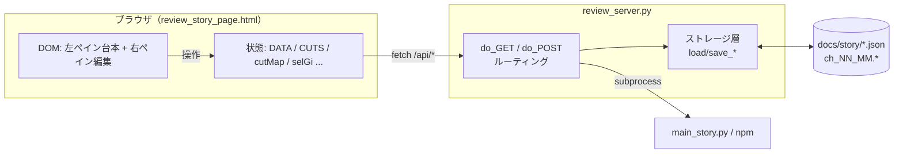

# 制作ツール詳細仕様（review_server.py）

`review_server.py` と `review_story_page.html` の仕様。**各操作とDOM/状態/API/永続キーの対応**を網羅する。UI/UX改善の作業仕様書として使う。

- 全体像・他ドキュメント：[`architecture.md`](architecture.md) / [`DEVELOPER_GUIDE.md`](DEVELOPER_GUIDE.md)
- 行番号は参照アンカー（実装変更で前後しうる・関数名で追うのが確実）。
- **方針**：Python標準ライブラリのみ（Flask等不使用）。メインUIは `review_story_page.html`、APIと他ページは `review_server.py`。外部Webフレームワークは足さない。

```bash
python review_server.py --dir docs/story --port 8765   # ./run review でも可。既定 127.0.0.1:8765
```

---

## 0. 全体アーキテクチャ

**静的フロント＋JSON API**の分離。ブラウザはファイルパスを一切知らず、`ci_k`（章_カット）キーと `/api/*` だけで通信する。サーバはほぼステートレス（唯一のグローバル状態は「対象ディレクトリ」`DIR`）。



### ページ一覧（GET）

| ルート | 定数（行） | 役割 |
|---|---|---|
| `/` | `LANDING_PAGE` (930) | 進捗ダッシュボード |
| `/story` | `review_story_page.html` | ★メイン review/edit UI |
| `/read` | `READ_PAGE` | 読み専用ファクトチェック |
| `/script` | `SCRIPT_PAGE` (1210) | 簡易台本エディタ |
| `/shorts` | `SHORTS_PAGE` (992) | ショート作成ハブ |
| `/compose` | `COMPOSE_PAGE` (1142) | ブラウザAIプロンプト（コピペ運用） |

### 共有テーマ `_BASE_CSS`（909–928）★リデザイン時の起点

| CSS変数 | 値 | 用途 |
|---|---|---|
| `--bg` | `#11151c` | 全体背景 |
| `--card` | `#1b212c` | カード/コンテナ背景 |
| `--line` | `#2c3543` | 枠線・区切り |
| `--fg` | `#d8dde6` | 本文テキスト |
| `--sub` | `#8693a5` | 補助テキスト・ヒント |
| `--ok` | `#3fa34d` | 成功・完了 |
| `--accent` | `#4a86ff` | 主要操作 |

共有クラス：`header`（固定ナビ）、`button`（`.primary`=accent / `.ok`=成功）、`main`（中央寄せ）、`.st`（ステータスチップ `.run`/`.ok`/`.ng`）、話者色（ずんだ=`#3fa34d` / めたん=`#d85a9c` / 他=`#90a0b5`）。
**ダークテーマ前提**。色を変えるならまずこの7変数を触る。

---

## 1. /story の全体構造

4領域（左=台本、中央=Remotionプレビュー、右=設定、下=タイムライン）。右ペインは `.wide` で全幅オーバーレイ化。

ヘッダーの作業モード切替は `workspaceMode` で管理する。`script` はPlayerを停止して台本・設定を50:50で表示し、下段タイムラインは維持する。`effect` は4領域を表示する。`reviewWorkspaceMode` として `localStorage` に保存する。

### DOMツリー

```
#main
└─ .tp（4領域グリッド）
   ├─ .tp-left（スクロール）
   │  ├─ .theme（テーマ入力 ＋ 尺見積りバー #estbar）
   │  └─ .chsec（章ごと・collapsed可）
   │     ├─ .chdiv（章ヘッダ：タイトル/バッジ/「章を編集」）
   │     └─ .line[data-gi]（発言ごと・左ボーダー=話者色）
   │        ├─ .rail（演出セグメントの帯＋境界ハンドル）
   │        ├─ .av（話者アイコン） ├─ .lc（.nm 名前+演出バッジ / .tx 本文）
   │        ├─ .mk（カットのサムネ） └─ .lacts（分割/削除・選択行のみ）
   ├─ #previewPane.tp-center（Remotion Player）
   ├─ #rpane.tp-right[.wide]（設定ペイン）
   │  ├─ .rwbar（全幅トグル .rwbtn）
   │  ├─ テロップ/リアクション編集（選択発言に対して）
   │  └─ .rtabs（タブ：画像 / 演出 / 章）→ 各タブのパネル
   └─ #timelinePane.timeline（セリフ・大演出・小演出）
```

### クライアント状態（`review_story_page.html` のグローバルJS変数）

| 変数 | 型 | 内容 | 初期化 | 変更契機 |
|---|---|---|---|---|
| `DATA` | obj | `{theme, chapters[], script[]}` ＝台本全体 | 起動時のPromise.all | 全ての台本編集 |
| `CUTS` | array | カットメタ `[{ch,ci,image,fit,filter,crop,...}]` | 同上 | `refreshCuts()` (1617) |
| `cutMap` | obj | `{"ci_k": cut}` の引き表 | 同上 | `refreshCuts()` |
| `candState` | obj | キー別の候補ピッカー状態 | {} | `loadCand()` (1642) |
| `selGi` | num | 選択中の発言index（右ペインの対象） | -1→0 | 行クリック (lineRow) |
| `selSeg` | str/null | 選択中の演出セグメントID | null | セグメントクリック |
| `rtab` | str/null | 右ペインのタブ（image/viz/chapter） | null | タブクリック |
| `dirty` | bool | 未保存フラグ | false | `markDirty()` |
| `collapsed` | Set | 畳んだ章index | {} | 章ヘッダのトグル |
| `rwide` | bool | 右ペイン全幅 | false | `setWide()` (2708) |
| `armEdge` | obj/null | 演出境界ドラッグ状態 `{seg,edge}` | null | レール境界クリック |
| `placeMode` | str | テロップ/リアクションの配置対象 | 'telop' | 位置モードのトグル |
| `candOpen` / `adjustOpen` | Set | 候補/補正パネルの開閉 | {} | トグルボタン |

### 起動シーケンス

```
Promise.all([ GET /api/script, GET /api/cuts, GET /api/status ])
  → DATA=script / CUTS,cutMap=cuts / TARGET_CHARS=status
  → 先頭章を展開 → render()
```

`render()` (2765) が `.tp-left` を再構築（章→発言）。`renderRight()` (2926) が `#rpane` をタブに応じて再構築。`api(p,b)` (1610) が全POSTの共通ラッパー。

---

## 2. /story 左ペイン：操作対応表

| 操作 | DOM | JSハンドラ（行） | 状態変化 | API | 永続キー |
|---|---|---|---|---|---|
| 章を畳む/開く | `.chdiv` クリック | `chapterDivider` (2813) | `collapsed` に章index追加/削除 | なし | （DOMのみ・非保存） |
| 発言を選択 | `.line` クリック | `lineRow` (2833) | `selGi`、あれば `selSeg` | なし | なし |
| 本文を編集 | `.tx` ダブルクリック→textarea | `startEditLine` (2912) | `tn.text`、`markDirty()` | （保存時 `/api/script`） | `script[].text` |
| 発言を分割 | `.lacts` ボタン | `splitTurn` (1802) | `DATA.script` に挿入（末尾系プロパティを後半へ移動） | — | `script[]` 増 |
| 発言を削除 | `.lacts` ボタン | `delTurn` (1825) | `DATA.script` から splice | — | `script[]` 減 |
| 章を編集 | `.chdiv` 「章を編集」 | → `rtab='chapter'` | `selGi=firstGiOfChapter(ci)` | （保存時） | `chapters[ci].*` |
| 演出範囲を移動 | `.rail` 境界ハンドル | `armEdge`→行タップ→`retagSeg` (2745) | `script[].vizSeg` 再タグ | — | `script[].vizSeg` |
| テーマ編集 | `.theme` input | render内 | `DATA.theme` | （保存時） | `theme` |
| 保存 | `#save` / Ctrl+S | `api('/api/script', DATA)` (3148) | `dirty=false` | `POST /api/script` | `script.json` 全体 |

**保存モデル**：あらゆる編集は**メモリ上の `DATA` を直接書き換え**、`markDirty()` でボタンを「● 保存」に。保存は **`DATA` 全体を `/api/script` にPOST**（差分ではない）。`beforeunload` で未保存ガード。

---

## 3. /story 右ペイン：画像タブ

`renderRight()` (2926) が `rtab` を見て `renderImageTab()` (3030) を表示。画像は `imgUrl(ci,k)` (1615) ＝ `/img/ci_k?v=Date.now()`（タイムスタンプでキャッシュ無効化）。

### 画像タブの操作

| 操作 | JSハンドラ（行） | API | 書き込む review.json キー |
|---|---|---|---|
| カット選択 | renderImageTab (3030) | — | `tn.cut`（script側） |
| カット追加/削除 | 3068付近 | 削除は `/api/script`→`/api/delete-cut`→`refreshCuts` | review.json 再採番 |
| 英語/日本語クエリ | input onchange | `openCand(...,'en'/'ja')` (1659) | `cut.image_query` / `image_query_ja` |
| 画像種別 | select | — | `cut.image_kind`（subject/ambient） |
| クリップボード貼付 | `pasteClipboard` (1694) | `/api/replace`（base64） | `cut.image` |
| 補正パネル開閉 | `adjustOpen` トグル | — | — |

### 補正パネル `buildAdjust()`（1828）

`setOpt(key,patch)` (1612) ＝ `/api/options` で部分更新。

| コントロール | API/関数 | review.json キー |
|---|---|---|
| fit（自動/cover/contain） | `setOpt(key,{fit})` | `cut.fit` |
| 明度/コントラスト/グレースケール | `setOpt(key,{filter})` (`cssFilter` 1783でライブ反映) | `cut.filter.{brightness,contrast,grayscale}` |
| 補正解除 | `setOpt(key,{filter:null})` | `cut.filter=null` |
| padding（contain余白） | `setOpt(key,{pad})` | `cut.pad` |
| 余白背景色 | `setOpt(key,{bg})` | `cut.bg` |
| 画像なし（hide） | `setOpt(key,{hide})` | `cut.hide` |
| 出典 | `/api/attribution` | `cut.attribution` |
| クロップ（ドラッグ矩形） | `drawCrop`/マウス→`setOpt(key,{crop})` (1901付近) | `cut.crop.{l,t,r,b}`（0..1正規化） |
| ファイル差し替え | FileReader→`/api/replace` | `cut.image` |
| ドロップ差し替え | `dropImport` (1624)→`/api/replace` or `/api/import-url` | `cut.image` |

### 候補ピッカー `buildCand()`（1751）/ `loadCand()`（1642）

`/api/candidates {query,kind,source,lang,page}` → `{sources[],candidates[{url,thumb,attribution}]}`。`candState[key]` に保持。ソース別タブ・言語切替（en/ja）・「もっと見る」（`append=true` でページ追加）。

- プレビュー：`previewCandidate` (1737) でモーダル → 「これにする」
- 採用：`applyCandidate` (1720) → `/api/import-url`。15MB超等は `shrinkImage()` (1665) でクライアント縮小してから `/api/replace`。

> **画像補正は即時保存（`/api/options` 等）**。台本テキストの「保存」とは独立。差し替え後は `refreshCuts()` でサーバ値（出典/補正リセット）に更新。

---

## 4. /story 右ペイン：演出（小演出）エディタ

演出は2系統。**章レベル（`ch.*`）= 中央ビジュアルの主モード**と、**発言レベル（`tn.*`）= 重ねがけ/時刻アンカー**。
UIは発言にアンカーフラグを立てるだけ。**絶対秒への解決は `main_story.build_chapter_topics`** が行う（[architecture.md](architecture.md#10-小演出の仕組みオーバーレイ中央置換) 参照）。

`VIZ_KEYS = ['panel','quiz','compare','stat','callouts']`（章レベル）。新UIは章の `ch.vizList[]`（`{id,type,...}`）にセグメントとして格納し、各発言の `tn.vizSeg=id` でひも付ける。

### 4.1 テロップ / リアクション（`renderRight` 内・発言レベル）

| コントロール | ハンドラ（行） | 書き込む tn.* |
|---|---|---|
| テロップ本文 | vArea (2941) | `telop` |
| 大きさ | `sizeCtl` (2956) | `telopSize` |
| 長さ short/normal/long | `durCtl` (2960) | `telopDur` |
| 文字/背景/枠の色 | `colCtl` (2963) | `telopColor` / `telopBg` / `telopBorder` |
| 位置（プレビュークリック） | `setPos` (2973)、`placeMode` | `telopX` / `telopY`（0..1） |
| リアクション記号 | チップ (2948) | `reaction` |
| 大きさ/長さ/位置 | 同上ヘルパ | `reactionSize` / `reactionDur` / `reactionX` / `reactionY` |

既定色：telop 文字 `#ffd84d` / 背景 `#121a28` / 枠 `#ffd84d`。

### 4.2 章レベル演出 `vizContent()`（2079–2489）

各タイプのエディタが書き込むフィールドと、対応する発言アンカー：

| タイプ | 主なフィールド（`ch.<type>`） | 発言アンカー（`tn.*`） | 描画コンポーネント |
|---|---|---|---|
| `panel` | `items[].{text,arrow_from_prev}` / `heading` / `overlay` / `pos` / `bg,bgOpacity` / `markerType,markerColor,markerSize` / `textColor,textSize` | `panel_event='shrink'` / `panel_item=N or [N,...]` | `DialoguePanel` |
| `quiz` | `question` / `answer` / `boxWidth` / `bg,bgOpacity,textColor` / `answerBg,answerBgOpacity,answerTextColor` / `questionSize,answerSize` | `reveal=true` | `QuizVisual` |
| `compare` | `left.{label,cut}` / `right.{label,cut}` / `labelColor,labelTextColor,labelSize` / `dividerColor` | `compare_item=0`(左) / `=1`(分割) | `CompareVisual` |
| `stat` | `value` / `unit` / `label` / `color` / `bg,bgOpacity` / `size` / `countSpeed` | `reveal=true` | `StatOverlay` |
| `callouts` | `callouts[].{text,x,y,lx?,ly?,arrow?}` ＋ `calloutStyle.{markerColor,markerSize,labelColor,labelSize,labelTextColor,labelBorderColor,arrowSize,arrowShape}` | `callout_item=k` | `CalloutOverlay` |

補助ヘルパ：`vRow/vText/vArea/vMini`（行・入力）、`vBgRow` (2060)（色+不透明度）、`csRow/styRow`（色+大きさ）。callouts/quizはプレビュー上のクリックで `x,y` を指定。

### 4.3 演出の追加/削除

- `vizAddMenu` (1992) / `vizAddRow` (3087)：タイプ選択で `ch.<type>` を初期化し、セグメント（`ch.vizList` に push、`tn.vizSeg=id`）を作る。同時に起点発言へアンカー（quiz/stat→`reveal`、compare→`compare_item=0`、callouts→`callout_item=0`、panel→`panel_event='shrink'`）を立てる。
- セグメント管理：`chSegs/newSegId/segOf/segRange/retagSeg/pruneEmptySegs/removeSeg`（2726–2763）。`migrateViz` (2731) が旧データを `vizList` へ移行。

> **章タブ** `renderChapterTab()` (3125)：タイトル/section/確度の編集と章の再生成（`/api/regenerate`）。

---

## 5. サーバAPI仕様

ルーティングは `do_GET` (3376) / `do_POST` (3449)。共通：`_json` (3351) / `_read_json` (3359) / `_html` (3368)。

### GET

| ルート | ハンドラ | 返り値 |
|---|---|---|
| `/api/status` | (3407) | `{dir, base, status{script,audio,meta}, target}` |
| `/api/script` | `load_script` (175) | `{theme,chapters[],script[]}` or `{error}` |
| `/api/cuts` | `load_review`+`image_dims` | `{cuts[], summary{total,approved,status}}`（w/h/bytesを付加） |
| `/api/shorts/list` | `main_trivia_netas`+`list_shorts` | `{netas[], shorts[]}` |
| `/api/shorts/jobstatus?job=` | `job_status` (293) | `{state, log?, out?, code?}` |
| `/api/compose/prompt` | `compose_main_prompt` (357) | `{prompt, theme}` |
| `/img/<ci_k>` | `read_image_bytes`+`find_cut` | 画像バイナリ |

### POST

| ルート | リクエスト | ハンドラ（行） | ファイル副作用 | 返り値 |
|---|---|---|---|---|
| `/api/script` | `{script[],chapters[]?,theme?}` | `apply_save_script` (651) | `script.json` | `{ok,message}` |
| `/api/fetch` | `{ch,ci,query,kind,lang?}` | `do_fetch_cut` (466) | `review.json`＋`ch_NN_MM.*` | `{ok,image?,attribution?}` |
| `/api/candidates` | `{query,kind,source?,lang?,page?}` | `do_candidates` (501) | なし（読み取り） | `{ok,sources[],candidates[]}` |
| `/api/options` | `{key,patch{fit?,crop?,filter?,hide?,pad?,bg?}}` | `apply_options` (837) | `review.json` | `{ok,applied}` |
| `/api/approve` | `{key,approved}` | `apply_approve` (798) | `review.json` | `{ok}` |
| `/api/attribution` | `{key,attribution}` | `apply_attribution` (790) | `review.json` | `{ok}` |
| `/api/import-url` | `{key,url,attribution?}` | `apply_import_url` (731) | `review.json`＋画像DL | `{ok,filename}` |
| `/api/replace` | `{key,filename,dataB64,attribution?}` | `apply_replace` (762) | `review.json`＋画像書込 | `{ok,filename}` |
| `/api/delete-cut` | `{ch,ci}` | `reindex_review_after_cut_delete` (143) | `review.json`＋画像リネーム | `{ok}` |
| `/api/regenerate` | `{indices[],fallback?}` | `do_regenerate_chapters` (541) | `script.json`/`review.json`/旧画像削除 | `{ok,regenerated[]}` |
| `/api/regenerate-all` | `{fallback?}` | `do_regenerate_all` (601) | 全 `script/review`＋旧画像削除 | `{ok,theme,chapters}` |
| `/api/set-dir` | `{dir}` | `set_active_dir` (228) | グローバル `DIR` | `{ok,dir}` |
| `/api/compose/import` | `{text}` | `import_main_script` (371) | `docs/story/script.json` | `{ok,theme,chapters,turns}` |
| `/api/compose/fetch` | `{}` | `start_fetch` (420) | subprocessジョブ | `{ok,job}` |
| `/api/shorts/prompt` | `{chapters[]}` | `compose_shorts_prompt` (386) | なし | `{ok,prompt}` |
| `/api/shorts/import` | `{text,chapters[]}` | `import_shorts_script` (399) | `docs/shorts/<slug>/script.json`×N | `{ok,slugs[]}` |
| `/api/shorts/fetch` | `{slug}` | `start_fetch` | ジョブ | `{ok,job}` |
| `/api/shorts/audio` | `{slug}` | `start_short_audio` (434) | ジョブ | `{ok,job}` |
| `/api/shorts/generate` | `{chapters[]}` | `start_short_generate` (311) | ジョブ | `{ok,job}` |
| `/api/shorts/render` | `{slug,cta?}` | `start_short_render_dir` (329) | ジョブ→mp4 | `{ok,job,out}` |
| `/api/continue` | `{}` | (3544) | `review.json`（approved化） | `{ok,command}` |

---

## 6. review.json スキーマ（カット1件）

`_blank_review_cut` (532) / `apply_options` (837) / `_clean_*`（806–893）/ `image_dims` (65) から導出。

```jsonc
{
  "cuts": [{
    "ch": 0, "ci": 0,                         // 章index・カットindex
    "title": "章タイトル（スナップショット）",
    "query": "english search", "kind": "subject|ambient",
    "image": "ch_00_00.jpg" | null,           // ファイル名（未取得=null）
    "attribution": "出典/ライセンス" | null,
    "approved": false,                         // 手動承認
    "fit": "cover|contain" | null,
    "crop":   { "l":0, "t":0, "r":1, "b":1 } | null,   // 0..1正規化
    "filter": { "brightness":1, "contrast":1, "grayscale":0 } | null,
    "hide": false,                             // 描画から除外
    "pad": 0 | null,                           // contain余白(px)
    "bg":  "#xxxxxx" | null,                   // 余白背景色
    "w": 1920, "h": 1080, "bytes": 123456      // /api/cuts GET が付加
  }],
  "status": "reviewing|approved"
}
```

---

## 7. 画像ファイルのライフサイクルと対象ディレクトリ

- **命名規約**：`ch_NN_MM.ext`（章_カット）。キーは `NN_MM`。
- **同期削除**：`reindex_review_after_cut_delete` (143) が削除後に後続カットを `rename_file` で詰め、`review.json` も再採番。**手でファイルを消すと番号がずれる**。
- **対象ディレクトリ**：グローバル `DIR`（既定 `docs/story`）/ `BASE_DIR`（本編）/ `SHORTS_ROOT`（`docs/shorts`）。全I/Oが `os.path.join(DIR, ...)`。`/api/set-dir` で本編↔ショートを切替（`set_active_dir`）。`is_short_dir()` で判定。
- **ジョブ**：`_spawn`/`job_status` が `main_story.py` や `npm` をsubprocessで起動し、`/api/shorts/jobstatus` でポーリング（ログ末尾を返す）。

---

## 8. 他ページ（簡略）

### `/` LANDING（930）
`render()` がステージカードを描画。`GET /api/status` で進捗、「本編に戻す」が `POST /api/set-dir`。各ページへのリンク。

### `/shorts` SHORTS（992）
3カード：①章チェック→`/api/shorts/generate` ②ブラウザAI（`/api/shorts/prompt`→`/api/shorts/import`）③ショート一覧（各 `/api/shorts/{fetch,audio,render}`＋`/api/set-dir`→`/story`）。`poll()` が1.5s間隔でジョブ監視、ログを色付け表示。

### `/compose` COMPOSE（1142）
`loadPrompt()`（`GET /api/compose/prompt`）→コピー→AI出力を `/api/compose/import`→`/api/compose/fetch`（画像取得ジョブ）。Gemini APIを使わずブラウザAIで台本を作る代替経路。

### `/script` SCRIPT（1210）
簡易台本エディタ。`DATA`→`render()`、`splitTurn`/`delTurn`/`autosize`、保存は `POST /api/script`。

### `/read` READ
読み専用。`setMode('full'/'sum')`・`render()`・`buildPlain()`→`copyContent()`（ファクトチェック用プレーンテキストをクリップボードへ）。`GET /api/script` のみ。

---

## 9. UI/UX改善の着眼点（仕様メモ）

実装方針の判断材料として、現仕様から見える特徴：

- **状態は `DATA`（台本）と `review.json`（画像）で二分**。台本は「保存ボタン」明示保存、画像補正は即時API保存。この**保存粒度の差**がユーザーの混乱源になりうる（要検討ポイント）。
- **大演出の時刻指定は「発言にアンカーを立てる」間接モデル**。タイムラインで発言境界を調整し、`build_chapter_topics` が後で秒へ解決する。中央プレビューはRemotion Playerを使用する。
- **`renderLegacy()` (2510) は未使用の旧アコーディオン版**（参考保存）。現役は二画面 `render()` (2765)。改修時は混同しない。
- メインUIは `review_story_page.html` に分離済み。追加ビルド工程はなく、CSS変数 `_BASE_CSS` が共通スタイル源。
- 改善は `_BASE_CSS`（テーマ）→ `review_story_page.html` の各 `render*` 関数（構造）→ 必要なら新APIの順で、**`meta.json` の契約と `review.json` スキーマを壊さない**範囲で進めるのが安全。
